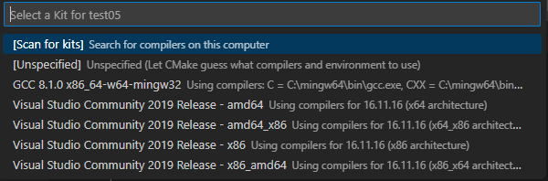

# Vulkan Setup for Windows Using CMake and Visual Studio Code

There are various vulkan resources and tutorial that shows how to setup vulkan but I could not find any that set it up from scratch using VSCode and CMake on Windows.

The goal of here is to setup base vulkan setup on WINDOWS using `CMake` on VSCode. The only Vulkan tutorial I found that shows how to setup Vulkan with CMake was from "Brendan Galea" on of his vulkan tutorials videos series. [Project Restructure and CMake - Vulkan Game Engine Tutorial 23](https://www.youtube.com/watch?v=ZuHK_5cJ6B8&list=PL8327DO66nu9qYVKLDmdLW_84-yE4auCR&index=31). This happened later on after the series has gone far.  But I was able to use this to come up with this basic setup.

Finally, The steps are what are found in [vulkan Tutorial](https://www.vulkan-tutorial.com) site in section on [Development Environment for Windows](https://vulkan-tutorial.com/Development_environment#page_Windows)

## Download and Installations

- Make sure you have Visual Studio and it development kit installed.
- Get `Vulkan SDK` and make sure it's installed on your Computer
- Find Get `GLFW` and `GLM`
You can get full installation instruction on [Vulkan Tutorial Dev. Env. for Windows](https://vulkan-tutorial.com/Development_environment#page_Windows)

## Getting CMake to work on VSCode

1. Create a folder in your prefer directory and give it your preferred name (I call it `vulkan_sample`). This will be your root folder.

2. Create a `src` folder this is where you will keep your cpp codes.

3. Inside the `src` folder, create a `main.cpp` file let write basic output

    ```c++
        #include <iostream>
        using std::cout;

        int main(){
            cout << "Say Hello to Vulkan! Hello\n";
            return 0;
        }
    ```

4. Create a `CMakeLists.txt` file in your root directory( i.e. `vulkan_sample` folder) then write the following

    ````bash
        cmake_minimum_required(VERSION 3.11.0)
        project(vulkan_sample VERSION 0.1.0 LANGUAGES C CXX)
        add_executable(${PROJECT_NAME} src/main.cpp)
    ````

5. Then press CTRL + SHIFT + P  and type `cmake select kit`.


 Click and select your kit(build for your compiler or linker) Let VScode read and update the panel below.


The build `CTRL + SHIFT + B` and select CMake build, then run by clicking the button shown

## Setting up vulkan for Visual Studio Code using CMake

### Basic file structure and code

1. Create the following sub folders in side your top folder(`vulkan_sample` in my case), `library` and `src`. Inside the library folder, Unzip add your GLFW and GLM folders and In your src folder create a `main.cpp` file.
 You should have folder structure like this:
 

2. Inside your `main.cpp`, copy and replace code with the following code from the [vulkan-tutorial Windows setup page](https://vulkan-tutorial.com/Development_environment#page_Windows). When executed successfully, this will display a window console.

    ```C++
    #define GLFW_INCLUDE_VULKAN
    #include <GLFW/glfw3.h>

    #define GLM_FORCE_RADIANS
    #define GLM_FORCE_DEPTH_ZERO_TO_ONE
    #include <glm/vec4.hpp>
    #include <glm/mat4x4.hpp>

    #include <iostream>

    int main() {
        glfwInit();

        glfwWindowHint(GLFW_CLIENT_API, GLFW_NO_API);
        GLFWwindow* window = glfwCreateWindow(800, 600, "Vulkan window", nullptr, nullptr);

        uint32_t extensionCount = 0;
        vkEnumerateInstanceExtensionProperties(nullptr, &extensionCount, nullptr);

        std::cout << extensionCount << " extensions supported\n";

        glm::mat4 matrix;
        glm::vec4 vec;
        auto test = matrix * vec;

        while(!glfwWindowShouldClose(window)) {
            glfwPollEvents();
        }

        glfwDestroyWindow(window);

        glfwTerminate();

        return 0;
    }
    ```

 Our next step will now be setup CMake for our project

### Vulkan CMake setup

Edit the `CMakeLists.txt` file in your root directory start the following codes:

1. First add minimum required in Cmake and Set project name

    ```bash
        cmake_minimum_required(VERSION 3.11.0)
        project(vulkan_sample VERSION 0.1.0) # project name
    ```

2. Setup path for your Vulkan. Find the installation directory for your Vulkan and copy the path. Then set the path for includes and libs. This will be used later.

    ```bash
        # Vulkan folder Include and library
        set(VK_SDK_PATH "C:/VulkanSDK/1.3.261.1")
        set(VK_INCLUDE "${VK_SDK_PATH}/Include")
        set(VK_LIB "${VK_SDK_PATH}/Lib")
    ```

    Note: `set(VARIABLE value)` is a one can make user defined variable.
    Make sure the `VK_SDK_PATH` set as `C:/VulkanSDK/1.3.261.1` correspond with the directory of your installed vulkan version. This is the version I installed as at the time of writing.

3. Set path for your  `GLFW`. Remember that this is located in your root directory `library`

    ```bash
        # Set path for GLFW, include and library
        set(GLFW_PATH "${PROJECT_SOURCE_DIR}/library/glfw-3.3.8.bin.WIN64") 
        set(GLFW_INCLUDE "${GLFW_PATH}/include")
        set(GLFW_LIB "${GLFW_PATH}/lib-vc2019")

    ```

    Note that the `${PROJECT_SOURCE_DIR}` is a CMake special variable that set the absolute path of your project root folder.

4. Set GLM include directory in `library` folder

    ```bash
        # Set path for GLM
        set(GLM_PATH "${PROJECT_SOURCE_DIR}/library/glm")  
    ```

5. Add executables, this are files in your main.cpp

    ```bash
        # this are files in your src directory
        add_executable(${PROJECT_NAME} src/main.cpp)
    ```

    Note `${PROJECT_NAME}` is the name your specified at the beginning in `project()` i.e "Vulkan_sample" in my case.

6. Add target include directories, those we have set so far

    ```bash
        target_include_directories(${PROJECT_NAME} PUBLIC
            ${PROJECT_SOURCE_DIR}/src
            ${VK_INCLUDE}
            ${GLFW_INCLUDE}
            ${GLM_PATH}
        )
    ```

7. Add target link directories and libraries

    ```bash
        target_link_directories(${PROJECT_NAME} BEFORE PUBLIC
        ${VK_LIB}
        ${GLFW_LIB}
        )

        target_link_libraries(${PROJECT_NAME} glfw3 vulkan-1)
    ```

8. Finally go to your `main.cpp` file and Press `CTR + SHIFT + B` and select cmake as build version

## Optional CMake setup

<!-- set()
file(GLOB_RECURSE) -->