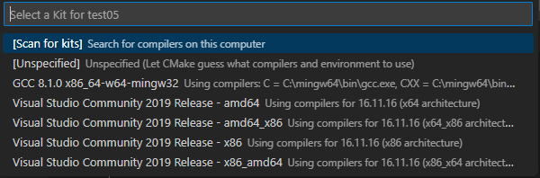
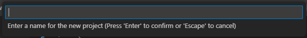
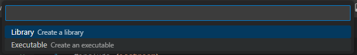
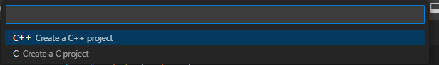
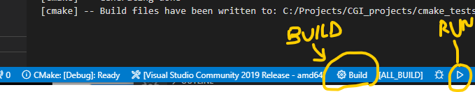

# Getting started with cmake for C++ in VSCode for Windows - using Visual Studio build

## STEP 1 - Cmake Installation


- Install microsoft "cmake" from Microsoft

## STEP 2 - Write a simple C++ code

- In order to keep this simple let's write a simple code
- create a directory `cmake_sample` (you can call it anything you want)
- In the directory create a folder `src` this is where you will keep source code
- Inside the `src` dir, add your `main.cpp`
- So your directory look like so:
    cmake_sample(root)
    |__src
        |__main.cpp

````C++
    // main.cpp
    #include <iostream>
    using std::cout;

    int main (){
        cout << "Hi Cmake Friend\n";
        return 0;
    }
````

## STEP 3 - Creating a CmakeLists.txt in your root directory

There are two approaches you can use to go by it.

### APROACH #1

- Run key `CTR + SHIFT + P` then type cmake, you will see "CMake Quick Start" click on it
- It will first ask for your kit weather you want to use Visual Studio Community kit or you have a MINGW install you decide but I'm using Visual Studio 2019 x64.


- It will ask for your "project name" - I am using `test1` you can any name you want
{:style="text-align:center"}

- It will also ask if you want to Create library or executable
{:style="text-align:center"}

- Then it will ask if you are creating C++ or C file
{:style="text-align:center"}

- Once you fill in those options, you get a default `CMakeLists.txt` with content:

````bash
    cmake_minimum_required(VERSION 3.0.0)
    project(test01 VERSION 0.1.0 LANGUAGES C CXX)

    include(CTest)
    enable_testing()

    add_executable(test01 src/main.cpp)

    set(CPACK_PROJECT_NAME ${PROJECT_NAME})
    set(CPACK_PROJECT_VERSION ${PROJECT_VERSION})
    include(CPack)
````

This is what is auto generate but the bare minimum you need is this:

````bash
    cmake_minimum_required(VERSION 3.0.0)
    project(test01 VERSION 0.1.0 LANGUAGES C CXX)
    add_executable(test01 src/main.cpp)

````

### APROACH #2

- In your root directory, i.e   "cmake_sample" folder, add a `CMakeLists.txt` file and type

````bash
    cmake_minimum_required(VERSION 3.0.0)
    project(test01 VERSION 0.1.0 )
    add_executable(test01 src/main.cpp)

````

Finish! this is my favourite method though

- In your directory (i.e. "cmake_sample" folder) , CMake will create a "build "folder where it will handle all the cmake processes.

## STEP 4 - BUILD AND RUN

If you check the panel at the bottom of your vscode, you will find a button for "build" and another one for "run".

{:style="text-align:center"}

Once you build and write `[build] Build finished with exit code 0` that means you can run

[back to step 1](#step-1---cmake-installation)